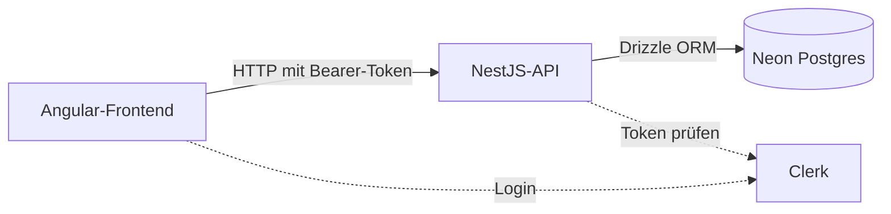

# Todo-App


Ja, noch eine Todo-App. Aber die hier hat einen Zweck: Ich wollte nicht das hundertste Tutorial nachklicken, sondern einmal komplett durch einen echten Stack. Vom Klick im Browser bis zur Zeile in der Datenbank, mit Login, eigener API und allem Ärger dazwischen.

Der Ärger war der lehrreichste Teil. Dazu weiter unten mehr.

Das Backend liegt in einem eigenen Repo: [myTodoApi](https://github.com/FlorianBohrer/myTodoApi).

## Was die App kann

- Login mit Clerk, jeder Nutzer sieht nur seine eigenen Todos
- Todos anlegen, abhaken, per Drag & Drop sortieren, löschen
- Eigene Kategorien mit Farbe und Icon, gespeichert pro Nutzer
- Filtern nach Status und Kategorie, dazu eine kleine Statistik
- Gespeichert wird in Postgres (Neon), nicht mehr im localStorage

## Aufbau



Im Frontend: Angular mit Standalone Components und Signals, Angular CDK für Drag & Drop, ngx-clerk, Lucide-Icons. Im Backend: NestJS mit Drizzle ORM auf einer Neon-Postgres-Datenbank.

Der Ablauf bei jedem Request: Ein HTTP-Interceptor im Frontend hängt das Clerk-Session-Token an. Im Backend prüft ein globaler Guard das Token und legt die User-ID in den Request. Jede Datenbankabfrage filtert auf diese ID. Ohne gültiges Token gibt es eine 401.

## Was ich dabei gelernt habe

### localStorage ist kein Datenspeicher

Die erste Version hat alles im localStorage gespeichert. Funktionierte super. Bis ich mich in einem zweiten Browser eingeloggt habe und meine Liste leer war. Im Nachhinein logisch: localStorage gehört dem Browser, nicht dem Nutzer. Also kam ein Backend her. Alte lokale Todos nimmt die App beim ersten Start übrigens einmalig mit, damit nichts verloren geht.

### Wenn "nichts funktioniert", ist es oft die Config

Mein bisher frustrierendster Bug: Datenbank nicht erreichbar, jeder Request 401, und ich habe lange im Code gesucht. Der Code war in Ordnung. In der .env stand eine Datenbank-URL, die noch der Platzhalter aus einer Anleitung war, und ein Secret Key, den ich mitsamt der spitzen Klammern aus dem Beispiel kopiert hatte. Zwei Zeilen, zwei Fehler. Seitdem prüfe ich zuerst die Konfiguration und dann den Code.

### Eingeloggt heißt nicht authentifiziert

Dass im Frontend jemand eingeloggt ist, interessiert das Backend erstmal nicht. Es glaubt nur dem Token, das mitgeschickt und serverseitig geprüft wird. Diese Trennung habe ich erst wirklich verstanden, als ich die Kette selbst gebaut habe: Interceptor im Frontend, Guard im Backend, Token-Prüfung gegen Clerk, User-ID an den Request.

### Git mit zwei Repos

Frontend und Backend liegen getrennt, und beide haben mich Nerven gekostet. Einmal "remote origin already exists", weil noch eine alte URL eingetragen war. Einmal ein Push auf den Branch "mast", den es dank Tippfehler natürlich nicht gab. Nichts davon war schlimm, aber ich weiß jetzt, was `git remote set-url` macht.

### Die UI darf nicht auf den Server warten

Beim Abhaken eines Todos wird die Oberfläche sofort aktualisiert und der Server im Hintergrund informiert. Schlägt der Request fehl, lädt die Liste neu. Ohne das fühlt sich jede Interaktion zäh an, mit ist der Unterschied zur alten localStorage-Version kaum spürbar.

### Schema-Änderungen als Migration

Kategorien und Sortier-Reihenfolge kamen erst später dazu. Statt die Tabellen von Hand zu ändern, erzeugt drizzle-kit Migrationen, die im Repo nachvollziehbar bleiben. Beim ersten Mal fühlt sich das nach Overhead an, beim dritten Schema-Update ist man dankbar.

## Lokal starten

Man braucht Node.js, einen kostenlosen Account bei [Neon](https://neon.tech) für die Datenbank und einen bei [Clerk](https://clerk.com) für den Login.

Zuerst das Backend:

```bash
git clone https://github.com/FlorianBohrer/myTodoApi.git
cd myTodoApi
npm install
```

Dann im Backend-Ordner eine `.env` anlegen mit drei Variablen: `DATABASE_URL` (die komplette Connection-URL aus der Neon-Konsole), `CLERK_SECRET_KEY` (aus dem Clerk-Dashboard unter API Keys) und `CLERK_AUTHORIZED_PARTIES` (darf leer bleiben). Die Werte 1:1 aus den Dashboards kopieren und keine spitzen Klammern aus Anleitungen übernehmen. Frag nicht.

```bash
npm run db:migrate
npm run start:dev
```

Die API läuft dann auf Port 3000. Jetzt das Frontend:

```bash
git clone https://github.com/FlorianBohrer/Todo_App.git
cd Todo_App
npm install
npm start
```

App im Browser öffnen: http://localhost:4200. Der Clerk Publishable Key steht in `src/app.ts` und muss zur eigenen Clerk-Instanz passen.
