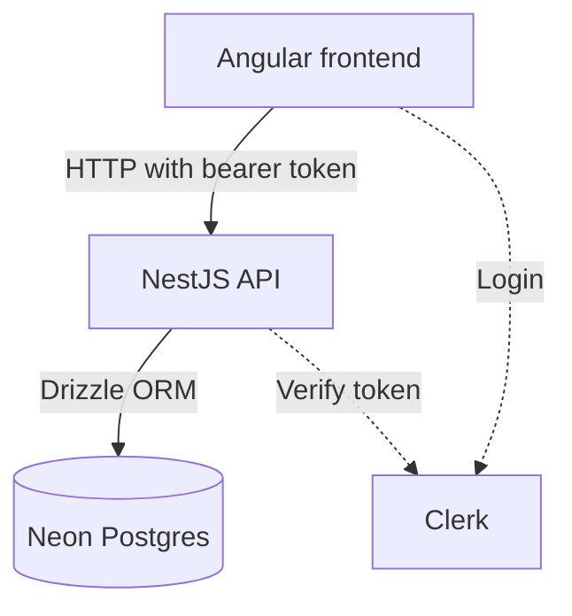

# Todo-App

Todo App
Yes, another todo app. But this one has actually a purpose: I didn't want to click through the hundredth tutorial, 
I wanted to go through a real stack once, end to end. From the click in the browser to the row in the database, with login, my own API, and all the trouble in between.

The trouble turned out to be the most educational part. More on that below.

The backend lives in its own repo: myTodoApi.

What the app does
Login with Clerk, every user only sees their own todos
Create todos, check them off, sort them via drag & drop, delete them
Custom categories with color and icon, stored per user
Filter by status and category, plus a small stats bar
Everything is stored in Postgres (Neon), not in localStorage anymore
How it's built

On the frontend: Angular with standalone components and signals, Angular CDK for drag & drop, ngx-clerk, Lucide icons. On the backend: NestJS with Drizzle ORM on a Neon Postgres database.

What happens on every request: an HTTP interceptor on the frontend attaches the Clerk session token. On the backend, a global guard verifies the token and puts the user ID on the request. Every database query filters on that ID. No valid token, no data, just a 401.

What I learned
localStorage is not a data store
The first version stored everything in localStorage. Worked great. Until I logged in from a second browser and my list was empty. Obvious in hindsight: localStorage belongs to the browser, not to the user. So a backend it was. The app migrates old local todos once on first load, by the way, so nothing gets lost.

When "nothing works", it's usually the config
My most frustrating bug so far: database unreachable, every request a 401, and I spent ages digging through the code. The code was fine. The .env contained a database URL that was still the placeholder from a tutorial, and a secret key I had copied along with the angle brackets from the example. Two lines, two mistakes. These days I check the configuration first and the code second.

Logged in is not authenticated
The backend doesn't care that someone is logged in on the frontend. It only trusts the token that gets sent along and verified server-side. I only really understood that separation once I had built the whole chain myself: interceptor on the frontend, guard on the backend, token verification against Clerk, user ID on the request.

Git with two repos
Frontend and backend live in separate repos, and both cost me some nerves. Once it was "remote origin already exists" because an old URL was still configured. Once it was a push to the branch "mast", which, thanks to a typo, obviously didn't exist. None of it was a big deal, but I now know what git remote set-url does.

The UI must not wait for the server
When you check off a todo, the UI updates immediately and the server is told in the background. If the request fails, the list reloads. Without this, every interaction feels sluggish; with it, you can barely tell the difference from the old localStorage version.

Schema changes as migrations
Categories and sort order were added later. Instead of changing the tables by hand, drizzle-kit generates migrations that stay traceable in the repo. The first time it feels like overhead; by the third schema update you're grateful.

Running it locally
You need Node.js, a free account at Neon for the database, and one at Clerk for the login.

Backend first:

git clone https://github.com/FlorianBohrer/myTodoApi.git
cd myTodoApi
npm install
Then create a .env in the backend folder with three variables: DATABASE_URL (the full connection URL from the Neon console), CLERK_SECRET_KEY (from the Clerk dashboard under API Keys), and CLERK_AUTHORIZED_PARTIES (can stay empty). Copy the values straight from the dashboards and don't bring any angle brackets along from tutorials. Don't ask.

npm run db:migrate
npm run start:dev
The API then runs on port 3000. Now the frontend:

git clone https://github.com/FlorianBohrer/Todo_App.git
cd Todo_App
npm install
npm start
Open the app at http://localhost:4200. 
The Clerk publishable key lives in src/app.ts and has to match your own Clerk instance.

